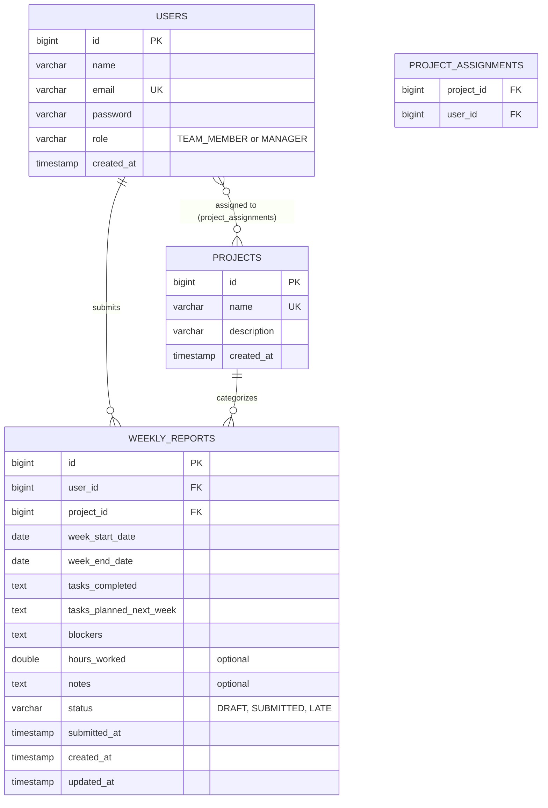

# Entity Relationship Diagram

This renders automatically on GitHub. You can also paste the code block below into
[Mermaid Live Editor](https://mermaid.live) to export an image/link for submission.

## Design notes

- **users → weekly_reports** is one-to-many: each report belongs to exactly one author.
- **projects → weekly_reports** is one-to-many: each report is tagged with exactly one project/category.
- **users ↔ projects** is many-to-many through `project_assignments`, an optional join table used to
  scope which projects a team member is expected to report against.
- A **unique constraint** on `(user_id, project_id, week_start_date)` in `weekly_reports` keeps the
  schema comparable across the team: one report per person, per project, per week — no duplicates,
  no custom fields.
- `role` is stored directly on `users` rather than a separate roles table, since the assignment only
  requires two fixed roles. This keeps the schema simple; a `roles` table would be the natural next
  step if roles became more dynamic (e.g. per-project permissions).
